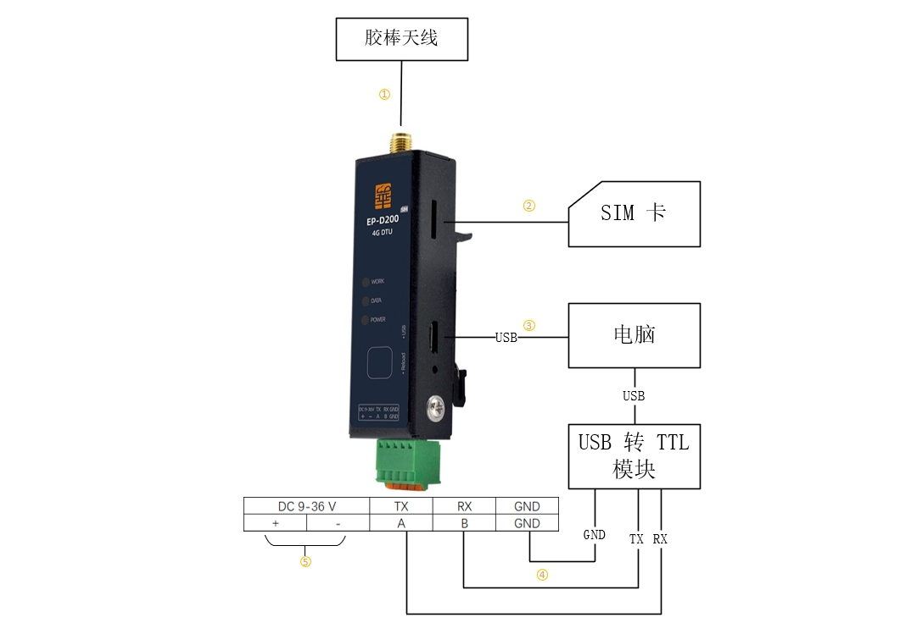
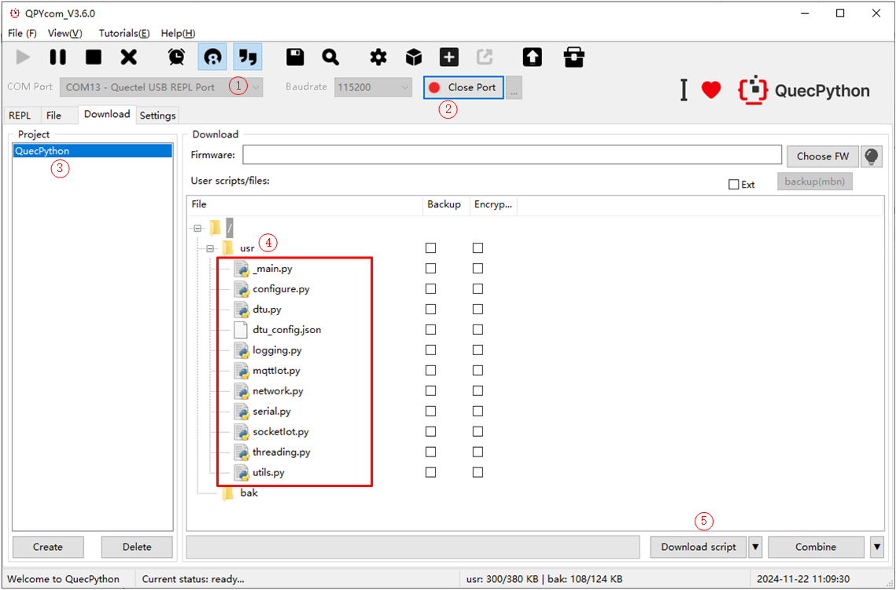
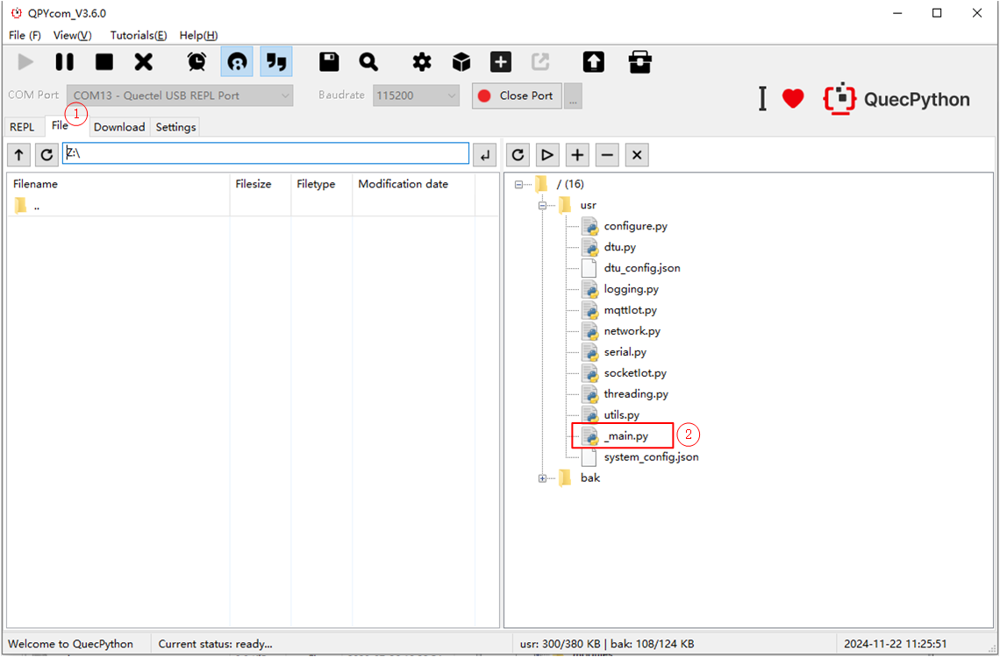
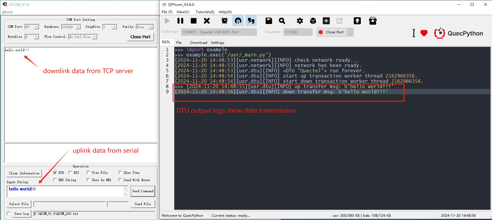

# QuecPython 4G DTU 快速上手

## 硬件准备

- Windows 电脑一台，建议 Win10 系统。
- 一套 [EC800GCN 华系列 DTU 开发板](https://python.quectel.com/doc/Getting_started/zh/evb/ec800g_hua_dtu.html)。
- 一张可用的 Nano Sim 卡。
- 一根胶棒天线。
- 一根 Mini USB 数据线。
- 一个 USB 转 TTL 模块。

## 环境搭建

- 下载并安装 EC800G 系列模组驱动：[QuecPython_USB_Driver_Win10_U_G](https://python.quectel.com/wp-content/uploads/2024/09/Quectel_Windows_USB_DriverU_V1.0.19.zip)。
- 下载并安装 [VSCode](https://code.visualstudio.com/)。
- 下载并解压 [QPYCom](https://python.quectel.com/wp-content/uploads/2024/09/QPYcom_V3.6.0.zip) 工具到电脑的合适位置。
- 下载并安装固件包[QPY_OCPU_BETA0002_EC800G_CNLD_FW](https://python.quectel.com/wp-content/uploads/2024/09/QPY_OCPU_BETA0002_EC800G_CNLD_FW.zip)。（固件包烧录请参阅 [使用 QPYcom 烧录固件](https://python.quectel.com/doc/Application_guide/zh/dev-tools/QPYcom/qpycom-dw.html)）
- 下载实验源码。

## 硬件连接

按照下图进行硬件连接：



① 连接胶棒天线。

② 插入 Nano Sim 卡。

③ 使用 mini USB 数据线连接至电脑。

④ 使用 USB 转 TTL 模块连接至电脑。TX（DTU开发板） 接 RX（USB 转 TTL 模块）；RX（DTU开发板） 接 TX（USB 转 TTL 模块）；GND（DTU开发板） 接  GND（USB 转 TTL 模块）共地。（⚠ 如果采用 RS485 接口，则两端的 A 线连接至 A 线，B 线连接至 B 线。）

⑤ 开发板采用 9~36 V 宽幅供电，正负极。

## 设备开发

### 修改配置文件

工程配置文件路径：`code/dtu_config.json`。 

本实验案例，基于 TCP 私有服务器数据透传做如下配置：

- 默认 `system_config.cloud` 配置项定义为 `"tcp"` 即 TCP 透传模式，系统会自行读取 `socket_private_cloud_config` 配置项。另外可选择 `\"mqtt\"` 配置，服务器参数根据实际情况修改 `mqtt_private_cloud_config` 配置项。

  ```python
  {
      "system_config": {
          "cloud": "tcp"  # 默认配置 tcp 透传模式，可配 "mqtt"
      }
  }
  ```

- 本实验采用 TCP 透传模式，用户需根据实际情况设置 `socket_private_cloud_config` 配置项中的 TCP 服务器域名（*domain*）和端口（*port*）。

  ```python
  {
      "socket_private_cloud_config": {
          "domain": "112.31.84.164",  # 服务器域名/ip
          "port": 8305,  # 端口号
          "timeout": 5,  # 超时时间 (unit: s)
          "keep_alive": 5  # 心跳周期 (unit: s)
      }
  }
  ```

-  `uart_config` 配置项是串口配置参数，默认是根据当前实验开发板做的配置，不可更改。如用户采用其他开发板则需要根据实际硬件进行配置。

```python
{
    "uart_config": {
        "port": 2,  # 串口号，根据实际硬件配置选择，当前实验不可更改
        "baudrate": 115200,  # 波特率
        "bytesize": 8,  # 数据位
        "parity": 0,  # 奇偶校验
        "stopbits": 1,  # 停止位
        "flowctl": 0,  # 流控
        "rs485_config": {  # RS485 配置
        	"gpio_num": 28,  # 485 控制脚，当前实验不可更改
            "direction": 0  # 引脚电平变化控制，1表示引脚电平变化为：串口发送数据之前由低拉高、发送数据之后再由高拉低，0表示引脚电平变化为：串口发送数据之前由高拉低、发送数据之后再由低拉高
        }
    }
}
```

完整配置文件模版如下：

```json
{
    "system_config": {
        "cloud": "tcp"
    },
    "mqtt_private_cloud_config": {
        "server": "mq.tongxinmao.com",
        "port": 18830,
        "client_id": "txm_1682300809",
        "user": "",
        "password": "",
        "clean_session": true,
        "qos": 0,
        "keepalive": 60,
        "subscribe": {"down": "/public/TEST/down"},
        "publish": {"up":  "/public/TEST/up"}
    },
    "socket_private_cloud_config": {
        "domain": "112.31.84.164",
        "port": 8305,
        "timeout": 5,
        "keep_alive": 5
    },
    "uart_config": {
        "port": 2,
        "baudrate": 115200,
        "bytesize": 8,
        "parity": 0,
        "stopbits": 1,
        "flowctl": 0,
        "rs485_config": {
        	"gpio_num": 28,
            "direction": 0
        }
    }
}
```

参数说明：

- `system_config.config`: 指定当前使用的私有云类型。目前支持tcp和mqtt。
- `mqtt_private_cloud_config`: MQTT私有云配置。
- `socket_private_cloud_config`: tcp私有云配置。
- `uart_config`：串口参数配置。

### 脚本导入并运行

下载安装 **QPYCom** 工具后使用该工具下载脚本至 QuecPython 模组。

> 💡 **Tips**
>
> QPYCom 安装和使用教程：https://python.quectel.com/doc/Application_guide/zh/dev-tools/QPYcom/index.html

下载步骤：

① 选择带有 "<font color="red">**REPL**</font>" 字样的 COM 口。（⚠ 该COM 口是 QuecPython 交互口，可以用来执行 python 代码实现与模组交互。脚本导入也是通过这种方式来实现的。）

② 打开交互口

③ 选择 下载 标签页，并新建一个项目名称。（名称自定义。）

④ 右键 "usr" 目录，使用 **一键导入** 功能， 选择并导入 DTU 代码仓库中的 `code` 文件夹。（⚠ `usr` 目录是 QuecPython 模组的用户存储空间，一般用于存放待执行的 python 脚本代码）。

⑤ 点击下载按钮开始下载。



运行主脚本

① 选择 文件 标签页

② 右键 `_main.py`，并选择执行改文件。



⚠ 该脚本为工程的主入口脚本。

⚠ 此处手动运行改脚本仅为调试方便，若将该脚本命名为 `main.py` 则该脚本在模组上电开机后自动运行。其原理在于模组上电开机后默认会自行运行 `usr` 下的 `main.py` 脚本。

### 业务调试

程序运行后，在 REPL 交互页面可以看到日志输出如下图所示。

左侧图示，我们使用 QCOM 模拟 MCU 打开用于透传的模组串口（即 USB 转 TTL 模块对应的 COM 口）。

右侧图示，REPL 交互口输出的模组日志。

使用串口工具 QCOM 模拟 MCU 串口上行数据，通过 DTU 透传至 TCP 回显服务器，再由回显服务器将相同数据通过 DTU 下行透传至 QCOM。



⚠ 本案例中采用的是 TCP 回显服务器，所以 QCOM 上行数据，经过 DTU 透传至 TCP 服务器接收到之后会立即按原路径下行。

