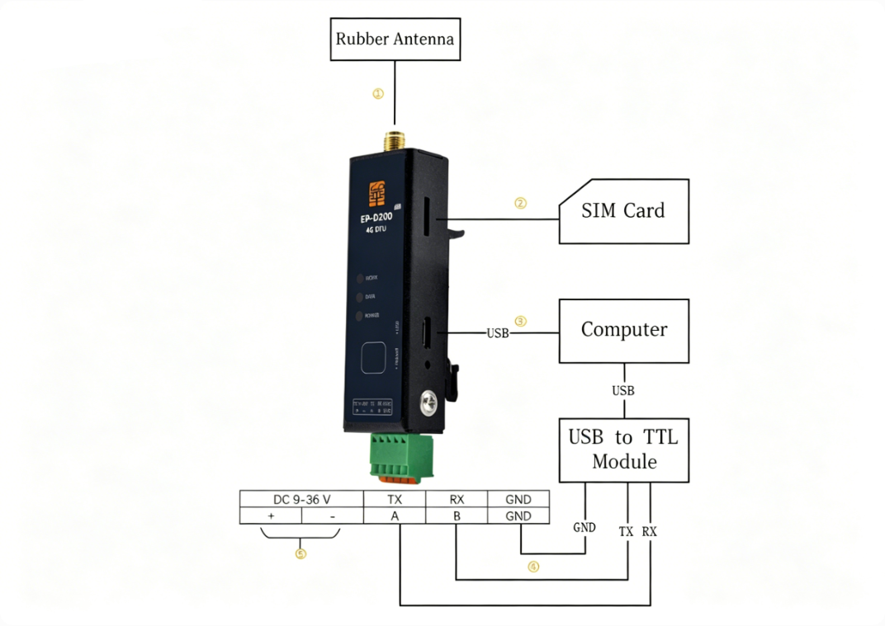
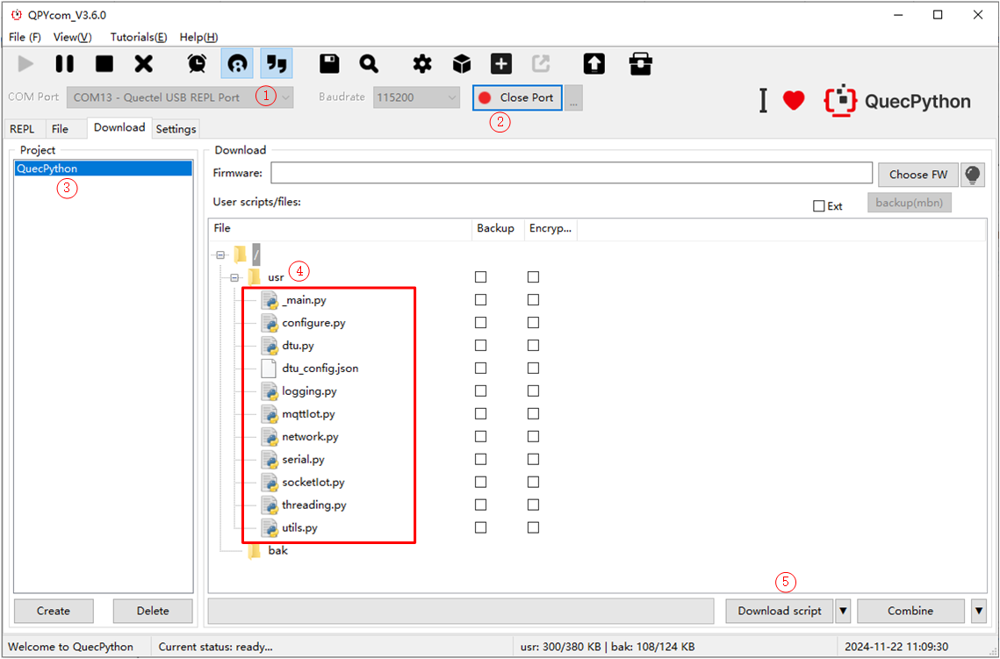
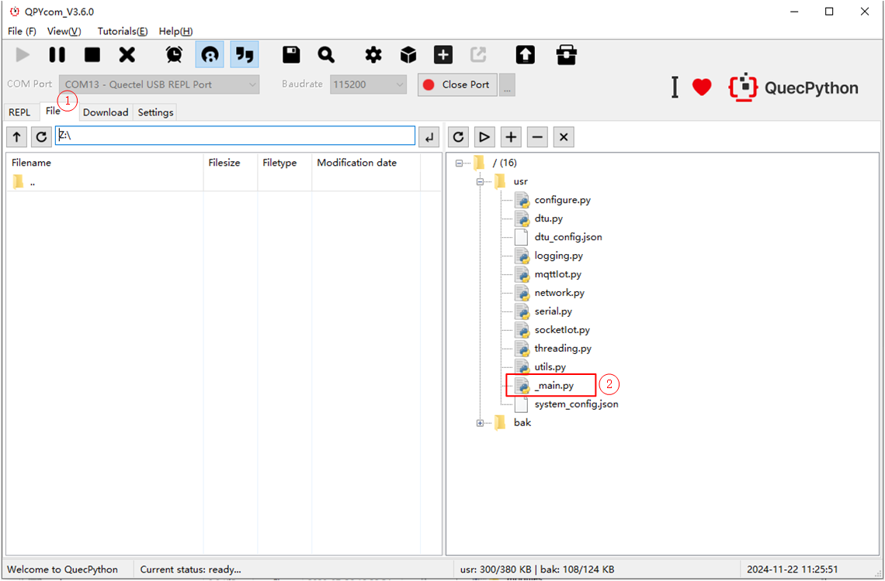
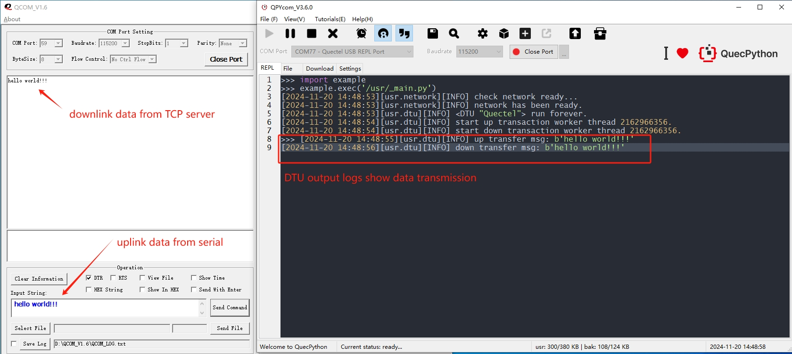

# QuecPython 4G DTU Quick Start 

## Hardware Preparation

- One Windows computer, Win10 system recommended\.

- One set of [EC800GCN Hua Series DTU Development Board](https://developer.quectel.com/doc/quecpython/Dev_board_guide/en/ec800g_hua_dtu.html)\.

- One available Nano Sim card\.

- One rubber stick antenna\.

- One Mini USB data cable\.

- One USB to TTL module\.

## Environment Setup

- Download and install EC800G series module driver: [QuecPython\_USB\_Driver\_Win10\_U\_G](https://developer.quectel.com/wp-content/uploads/2024/09/Quectel_Windows_USB_DriverU_V1.0.19.zip)\.

- Download and install [VSCode](https://code.visualstudio.com/)\.

- Download and extract [QPYCom](https://developer.quectel.com/wp-content/uploads/2024/09/QPYcom_V4.1.0.zip) tool to a suitable location on your computer\.

- Download and install firmware package [QPY\_OCPU\_BETA0002\_EC800G\_CNLD\_FW](https://developer.quectel.com/wp-content/uploads/2024/09/QPY_OCPU_BETA0002_EC800G_CNLD_FW.zip)\. \(For firmware flashing, please refer to [Using QPYcom to Flash Firmware](https://developer.quectel.com/doc/quecpython/Getting_started/en/4G/flash_firmware.html)\)

- Download the experimental source code\.

## Hardware Connection

Follow the diagram below for hardware connection:



① Connect the rubber stick antenna\.

② Insert the Nano Sim card\.

③ Connect to the computer using the mini USB data cable\.

④ Connect to the computer using the USB to TTL module\. TX \(DTU development board\) connects to RX \(USB to TTL module\); RX \(DTU development board\) connects to TX \(USB to TTL module\); GND \(DTU development board\) connects to GND \(USB to TTL module\) for common ground\. \(⚠ If using RS485 interface, connect wire A to wire A and wire B to wire B on both ends\.\)

⑤ The development board adopts 9\~36 V wide voltage power supply, pay attention to positive and negative poles\.

## Device Development

### Modify Configuration File

Project configuration file path: `code/dtu_config.json`\.

In this experimental case, based on TCP private server data transparent transmission, make the following configurations:

- The default `system_config.cloud` configuration item is defined as `"tcp"`, which is TCP transparent transmission mode\. The system will automatically read the `socket_private_cloud_config` configuration item\. Alternatively, you can choose `"mqtt"` configuration, and modify the `mqtt_private_cloud_config` configuration item according to actual server parameters\.

    ```python
    {
        "system_config": {
            "cloud": "tcp"  # Default configuration tcp transparent transmission mode, configurable as "mqtt"
        }
    }
    ```

- This experiment adopts TCP transparent transmission mode\. Users need to set the TCP server domain \(*domain*\) and port \(*port*\) in the `socket_private_cloud_config` configuration item according to the actual situation\.

    ```python
    {
        "socket_private_cloud_config": {
            "domain": "112.31.84.164",  # Server domain/ip
            "port": 8305,  # Port number
            "timeout": 5,  # Timeout (unit: s)
            "keep_alive": 5  # Heartbeat cycle (unit: s)
        }
    }
    ```

- The `uart_config` configuration item is the serial port configuration parameter\. The default is configured according to the current experimental development board and cannot be changed\. If users use other development boards, they need to configure according to the actual hardware\.

```python
{
    "uart_config": {
        "port": 2,  # Serial port number, select according to actual hardware configuration, cannot be changed in current experiment
        "baudrate": 115200,  # Baud rate
        "bytesize": 8,  # Data bits
        "parity": 0,  # Parity check
        "stopbits": 1,  # Stop bits
        "flowctl": 0,  # Flow control
        "rs485_config": {  # RS485 configuration
        	"gpio_num": 28,  # 485 control pin, cannot be changed in current experiment
            "direction": 0  # Pin level change control, 1 means pin level change: pull from low to high before serial port sends data, pull from high to low after sending data; 0 means pin level change: pull from high to low before serial port sends data, pull from low to high after sending data
        }
    }
}
```

The complete configuration file template is as follows:

```json
{
    "system_config": {
        "cloud": "tcp"
    },
    "mqtt_private_cloud_config": {
        "server": "mq.tongxinmao.com",
        "port": 18830,
        "client_id": "txm_1682300809",
        "user": "",
        "password": "",
        "clean_session": true,
        "qos": 0,
        "keepalive": 60,
        "subscribe": {"down": "/public/TEST/down"},
        "publish": {"up":  "/public/TEST/up"}
    },
    "socket_private_cloud_config": {
        "domain": "112.31.84.164",
        "port": 8305,
        "timeout": 5,
        "keep_alive": 5
    },
    "uart_config": {
        "port": 2,
        "baudrate": 115200,
        "bytesize": 8,
        "parity": 0,
        "stopbits": 1,
        "flowctl": 0,
        "rs485_config": {
        	"gpio_num": 28,
            "direction": 0
        }
    }
}
```

Parameter description:

- `system_config.config`: Specifies the currently used private cloud type\. Currently supports tcp and mqtt\.

- `mqtt_private_cloud_config`: MQTT private cloud configuration\.

- `socket_private_cloud_config`: TCP private cloud configuration\.

- `uart_config`: Serial port parameter configuration\.

### Script Import and Run

After downloading and installing the **QPYCom** tool, use this tool to download the script to the QuecPython module\.

> 💡 **Tips**
> 
> QPYCom installation and usage tutorial: [https://developer.quectel.com/doc/quecpython/Application_guide/en/dev-tools/QPYcom/index.html](https://developer.quectel.com/doc/quecpython/Application_guide/en/dev-tools/QPYcom/index.html)
> 

Download steps:

① Select the COM port with **REPL**\. \(⚠ This COM port is the QuecPython interactive port, which can be used to execute python code to interact with the module\. Script import is also implemented in this way\.\)

② Open the interactive port

③ Select the Download tab, and create a new project name\. \(The name is customizable\.\)

④ Right\-click the directory, use the **one\-click import** function, select and import the `code` folder in the DTU code repository\. \(⚠ The `usr` directory is the user storage space of the QuecPython module, generally used to store python script code to be executed\)\.

⑤ Click the download button to start downloading\.



Run the main script

① Select the File tab

② Right\-click `_main.py`, and select to execute this file\.




⚠ This script is the main entry script of the project\.

⚠ Manually running this script here is only for debugging convenience\. If this script is named `main.py`, it will run automatically after the module is powered on\. The principle is that after the module is powered on, it will automatically run the `main.py` script under `usr` by default\.

### Business Debugging

After the program runs, you can see the log output on the REPL interactive page as shown in the figure below\.

In the left diagram, we use QCOM to simulate the MCU to open the module serial port for transparent transmission \(that is, the COM port corresponding to the USB to TTL module\)\.

In the right diagram, the module log output from the REPL interactive port\.

Use the serial port tool QCOM to simulate the MCU serial port uplink data, transparently transmit to the TCP echo server through DTU, and then the echo server transparently transmits the same data downlink to QCOM through DTU\.



⚠ A TCP echo server is used in this case, so the QCOM uplink data, after being transparently transmitted to the TCP server through DTU, will immediately go downlink along the original path\.
